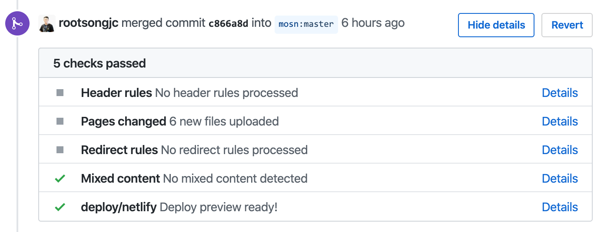

To contribute to MOSN's documentation, you need to:

- Create a [GitHub account](https://github.com/).

This documentation is published in compliance with [Apache 2.0](https://github.com/mosn/mosn.io/blob/master/LICENSE) license.

## How to contribute {#how-to}

You can contribute to MOSN's documentation in the following three ways:

- To edit an existing topic, open the page with your browser, click **Edit This Page** on the upper-right side, edit the GitHub page that appears, and submit the modifications.
- To make general edits, follow the procedure in [Add content](#add).
- To review an existing pull request (PR), follow the procedure in the [Review PRs](#review).

PRs are immediately displayed on <https://mosn.io> after being merged.

## Add content {#add}

To add content, you need to create a repository branch and submit a PR to the mater repository from the branch. Perform the following steps:

1. Access the MOSN repository at GitHub <https://github.com/mosn/mosn.io>.
1. Click **Fork** in the upper-right corner to fork a copy of the MOSN repository to your GitHub account.
1. Clone your fork to your computer and make modifications as required.
1. Upload the modifications to your fork repository when you are ready to submit them to us.
1. Go to the index page of your fork repository and click **New pull request** to submit a PR.

## Review PRs {#review}

You can directly comment on a PR. To add detailed comments, perform the following steps:

1. Add detailed comments to the PR. If possible, directly add comments to the corresponding files and file lines.
1. Provide suggestions to the PR authors and contributors in the comments as appropriate.
1. Publish and share your comments with the PR contributors.
1. Merge the PR after publishing the comments and reaching an agreement with the contributors.

## Preview PRs {#preview}

You can preview your PR online or run Hugo on your computer to access the MOSN website for real-time preview.

### Online preview

After you submit a PR, a series of check items are displayed on the corresponding PR page at GitHub. The `deploy/netlify` step generates the preview page on the MOSN official website. You can click **Details** to go to the preview page. A preview page is constructed each time you submit the same PR.

This temporary website ensures normal page display after the PR is merged.

### Local preview

In addition to online preview, you can also preview your PR with [Hugo](https://github.com/gohugoio/hugo) (the v0.55.5 extended version is recommended). You can run `hugo server` at the root directory of your code repository and then access `http://localhost:1313` with your browser.

